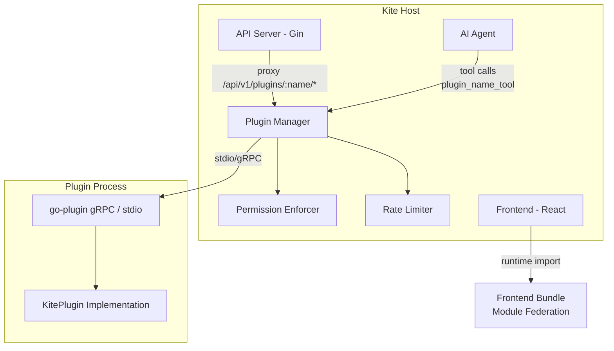

# Plugin System

Kite's plugin system lets you extend both the backend (Go) and frontend (React) with custom functionality — routes, AI tools, resource handlers, sidebar pages, and settings panels. Plugins run as isolated processes and communicate with Kite over gRPC.

## Quick Start

```bash
# Install the CLI
go install github.com/zxh326/kite/cmd/kite-plugin@latest

# Create a plugin with frontend
kite-plugin init my-plugin --with-frontend

# Build and validate
cd my-plugin && go mod tidy && make build
kite-plugin validate

# Package for distribution
kite-plugin package
```

This generates:

```
my-plugin/
├── main.go              # Plugin entry point (implements KitePlugin)
├── manifest.yaml        # Metadata, permissions, frontend config
├── go.mod
├── Makefile
└── frontend/            # (with --with-frontend)
    ├── package.json
    ├── vite.config.ts
    ├── tsconfig.json
    └── src/
        ├── PluginPage.tsx
        └── Settings.tsx
```

## Installation

To install a plugin, place its directory (or extract its `.tar.gz` archive) into Kite's plugin directory and restart. The default directory is `./plugins/` relative to the Kite binary. Override with the `KITE_PLUGIN_DIR` environment variable:

```bash
# Default
./plugins/
  cost-analyzer/
    cost-analyzer       # compiled binary
    manifest.yaml
    frontend/dist/      # (optional)

# Custom location
KITE_PLUGIN_DIR=/etc/kite/plugins kite
```

On startup Kite scans the directory, resolves dependencies, and loads each plugin. The startup log reports the result:

```
[PLUGIN] loaded cost-analyzer v1.2.0
[PLUGIN] No plugins found          ← no plugins directory
```

## Architecture



**Load sequence on startup:**

1. Scan `KITE_PLUGIN_DIR` for subdirectories containing `manifest.yaml`
2. Validate manifests and resolve dependency order (topological sort)
3. Start each plugin binary as a subprocess via HashiCorp go-plugin (stdio gRPC)
4. Call `Manifest()`, `RegisterAITools()`, `RegisterResourceHandlers()` to pull static metadata
5. Register permissions in `PermissionEnforcer` and rate-limit buckets in `PluginRateLimiter`
6. Mount plugin routes under `/api/v1/plugins/<name>/`

## Plugin Lifecycle & States

Every loaded plugin has a runtime state:

| State | Meaning |
|---|---|
| `loaded` | Running and healthy |
| `failed` | Crashed or validation error — `error` field contains details |
| `disabled` | Explicitly disabled via admin API, not started |
| `stopped` | Gracefully shut down |

Query states via `GET /api/v1/plugins/`. Plugins in `failed` state are visible but their endpoints return `503 Service Unavailable`.

## Go Interface Reference

Every plugin must implement `KitePlugin`. Use `sdk.BasePlugin` to get no-op defaults:

```go
import (
    "github.com/zxh326/kite/pkg/plugin"
    "github.com/zxh326/kite/pkg/plugin/sdk"
)

type MyPlugin struct{ sdk.BasePlugin }
```

### `Manifest() PluginManifest`

Returns metadata including permissions. **Required** — the default returns an empty manifest which fails validation.

```go
func (p *MyPlugin) Manifest() plugin.PluginManifest {
    return plugin.PluginManifest{
        Name:        "my-plugin",
        Version:     "1.0.0",
        Description: "Does cool things",
        Author:      "Your Name",
        Priority:    100,       // load order — lower loads first
        RateLimit:   200,       // max HTTP requests/second (default 100)
        Permissions: []plugin.Permission{
            {Resource: "pods", Verbs: []string{"get", "list"}},
        },
        Requires: []plugin.Dependency{
            {Name: "core-lib", Version: ">=1.0.0"},
        },
    }
}
```

### `RegisterRoutes(group gin.IRoutes)`

Add HTTP endpoints scoped to `/api/v1/plugins/<name>/`. Auth middleware is already applied.

```go
func (p *MyPlugin) RegisterRoutes(g gin.IRoutes) {
    g.GET("/stats", p.handleStats)
    g.POST("/action", p.handleAction)
}
```

### `RegisterMiddleware() []gin.HandlerFunc`

Return Gin middleware inserted into Kite's **global** HTTP pipeline. Applies to all requests, not just plugin routes. Return `nil` if not needed.

### `RegisterAITools() []AIToolDefinition`

Register tools invocable by users through the Kite AI chat. Tools are namespaced automatically — the AI agent sees them as `plugin_<pluginName>_<toolName>`.

```go
func (p *MyPlugin) RegisterAITools() []plugin.AIToolDefinition {
    return []plugin.AIToolDefinition{
        sdk.NewAITool(
            "get_cost_summary",
            "Get a cost summary for the current cluster",
            map[string]any{
                "namespace": map[string]any{
                    "type":        "string",
                    "description": "Kubernetes namespace to query",
                },
            },
            []string{}, // required params
        ),
    }
}
```

### `RegisterResourceHandlers() map[string]ResourceHandler`

Register custom resource types with full CRUD. The key is the resource name as it appears in API routes.

```go
func (p *MyPlugin) RegisterResourceHandlers() map[string]plugin.ResourceHandler {
    return map[string]plugin.ResourceHandler{
        "cost-reports": &CostReportHandler{},
    }
}
```

`ResourceHandler` requires: `List`, `Get`, `Create`, `Update`, `Delete`, `Patch`, `IsClusterScoped`.

### `OnClusterEvent(event ClusterEvent)`

Called when clusters are added, removed, or updated. Event types: `added`, `removed`, `updated`.

```go
func (p *MyPlugin) OnClusterEvent(event plugin.ClusterEvent) {
    sdk.Logger().Info("cluster changed",
        "type", event.Type,
        "cluster", event.ClusterName,
    )
}
```

### `Shutdown(ctx context.Context) error`

Called during graceful shutdown. Release resources within the context deadline.

## AI Tool Reference

### Simple tool (definition only)

```go
sdk.NewAITool(
    "tool_name",
    "Shown to the AI to decide when to call this",
    map[string]any{
        "param": map[string]any{
            "type":        "string",
            "description": "What this parameter does",
        },
    },
    []string{"param"}, // required params
)
```

### Full tool with executor and authorizer

```go
sdk.NewAIToolFull(
    definition,

    // Executor — receives the current cluster and parsed args
    func(ctx context.Context, cs *cluster.ClientSet, args map[string]any) (string, error) {
        ns := args["namespace"].(string)
        // ... call Kubernetes or plugin backend
        return "result text shown to AI", nil
    },

    // Authorizer — return nil to allow, error to deny
    func(user model.User, cs *cluster.ClientSet, args map[string]any) error {
        if !user.IsAdmin() {
            return errors.New("admin only")
        }
        return nil
    },
)
```

**AI tool naming:** When the AI agent calls a plugin tool, the name is automatically prefixed: `plugin_<pluginName>_<toolName>`. You can also invoke tools directly via the HTTP API (see [API Reference](#api-reference)).

### Logging in plugins

Use the structured logger — output goes to stderr, captured by go-plugin:

```go
sdk.Logger().Info("processed request", "namespace", ns, "count", len(items))
sdk.Logger().Error("something failed", "err", err)
```

## Dependency Resolution

Plugins can declare version-constrained dependencies on other plugins:

```yaml
requires:
  - name: base-auth-plugin
    version: ">=1.0.0"
  - name: metrics-plugin
    version: "^2.3.0"
```

Kite resolves a topological load order using Kahn's algorithm. If a required plugin is missing or the version constraint is not satisfied, all dependent plugins fail with a descriptive error. Circular dependencies are detected and reported.

## Security Model

### Permission enforcement

Every HTTP request to a plugin proxy route is checked against the permissions declared in `manifest.yaml` before being forwarded to the plugin process. HTTP methods are automatically mapped to Kubernetes API verbs:

| HTTP Method | Kubernetes Verb |
|---|---|
| GET | `get` |
| POST | `create` |
| PUT | `update` |
| PATCH | `patch` |
| DELETE | `delete` |

A plugin calling an undeclared resource or verb receives `403 Forbidden`. Denials are logged and written to the audit trail.

### Rate limiting

Each plugin gets a **token bucket** rate limiter sized by `rateLimit` in its manifest. The burst capacity is set to **2× the sustained rate** to absorb short spikes. Default: 100 requests/second (burst 200). When the limit is exceeded, the proxy returns `429 Too Many Requests`.

### Process isolation

- Each plugin runs as a **separate OS process**
- Communication over gRPC via **stdio** — no network socket is opened
- Frontend modules are sandboxed in the browser via Module Federation scope isolation

### Audit logging

All plugin operations are automatically written to Kite's `ResourceHistory` audit log with the following resource types:

| `ResourceType` | When |
|---|---|
| `plugin` | Generic plugin HTTP proxy call |
| `plugin_tool` | AI tool execution |
| `plugin_resource` | ResourceHandler CRUD operation |

Audit records include the operator ID, success/failure flag, and error message.

## Manifest Schema

```yaml
# Required
name: my-plugin            # Unique identifier — used in API routes
version: 1.0.0             # Semver

# Optional metadata
description: "My plugin"
author: "Your Name"
priority: 100              # Load order — lower loads first (default 100)
rateLimit: 100             # Max sustained req/s (burst = 2×, default 100)

# Dependencies on other plugins (semver constraints)
requires:
  - name: other-plugin
    version: ">=1.0.0"

# Kubernetes resources this plugin may access
permissions:
  - resource: pods
    verbs: [get, list, watch]
  - resource: deployments
    verbs: [get, list]
  - resource: prometheus       # custom verb for Prometheus access
    verbs: [get]

# Frontend config — omit for backend-only plugins
frontend:
  remoteEntry: "/plugins/my-plugin/static/remoteEntry.js"
  exposedModules:
    ./Dashboard: DashboardPage
    ./Settings: SettingsPanel
  routes:
    - path: /                  # mounted under /plugins/<name>/
      module: "./Dashboard"
      sidebarEntry:
        title: "My Plugin"
        icon: currency-dollar  # Tabler icon — kebab-case, no "Icon" prefix
        section: observability
        priority: 50           # lower = higher in section
    - path: /detail/:id
      module: "./Dashboard"    # no sidebarEntry = hidden route
  settingsPanel: "./Settings"  # module shown in Kite's Settings page

# Settings fields exposed in admin UI
settings:
  - name: api_key
    label: "API Key"
    type: text
    required: true
    description: "Authentication key for the external service"
  - name: enabled
    label: "Enable integration"
    type: boolean
    default: "true"
  - name: interval
    label: "Refresh interval (s)"
    type: number
    default: "30"
  - name: log_level
    label: "Log level"
    type: select
    default: "info"
    options:
      - label: Debug
        value: debug
      - label: Info
        value: info
      - label: Error
        value: error
```

**Setting field types:** `text`, `number`, `boolean`, `select`, `textarea`.

Settings are persisted in Kite's database and accessible via the Admin API. They are **not** automatically forwarded to the plugin process — read them from the database in your plugin if needed.

## Frontend SDK

The `@kite-dashboard/plugin-sdk` package provides hooks, components, and build helpers for plugin frontends.

### Installation

```bash
# From within your plugin's frontend/ directory
pnpm add @kite-dashboard/plugin-sdk
```

### `useKiteCluster()`

```tsx
import { useKiteCluster } from '@kite-dashboard/plugin-sdk'

function MyComponent() {
  const { currentCluster, clusters, isLoading } = useKiteCluster()
  return <p>Current cluster: {currentCluster}</p>
}
```

### `useKiteApi()`

Returns the authenticated Kite API client. Requests automatically carry the current cluster header and auth token.

```tsx
import { useKiteApi } from '@kite-dashboard/plugin-sdk'

function PodList() {
  const api = useKiteApi()
  useEffect(() => {
    api.get('/pods').then(setPods)
  }, [])
}
```

### `usePluginApi(pluginName)`

Scoped client — all requests are prefixed with `/api/v1/plugins/<name>/`. Supports `get`, `post`, `put`, `patch`, `delete`.

```tsx
import { usePluginApi } from '@kite-dashboard/plugin-sdk'

function CostView() {
  const api = usePluginApi('cost-analyzer')

  useEffect(() => {
    // → GET /api/v1/plugins/cost-analyzer/summary
    api.get('/summary').then(setData)
    // → POST /api/v1/plugins/cost-analyzer/refresh
    api.post('/refresh', { force: true }).then(handleResult)
  }, [])
}
```

### `KitePluginPage`

Layout wrapper for consistent page styling that matches Kite's native pages:

```tsx
import { KitePluginPage } from '@kite-dashboard/plugin-sdk'

export default function CostDashboard() {
  return (
    <KitePluginPage title="Cost Dashboard" description="Cluster cost overview">
      <CostTable />
    </KitePluginPage>
  )
}
```

### `definePluginFederation(options)`

Vite build helper. Spread the return value into your `defineConfig` call:

```ts
// frontend/vite.config.ts
import react from '@vitejs/plugin-react'
import { defineConfig } from 'vite'
import { definePluginFederation } from '@kite-dashboard/plugin-sdk/vite'

export default defineConfig({
  plugins: [react()],
  ...definePluginFederation({
    name: 'cost-analyzer',       // must match manifest.yaml name
    exposes: {
      './CostDashboard': './src/CostDashboard.tsx',
      './Settings':      './src/Settings.tsx',
    },
  }),
})
```

The helper produces an ES module library build. The following packages are **externalized** (provided by the Kite host at runtime — do not bundle them):

| Package | Version provided |
|---|---|
| `react` | 19.0.0 |
| `react-dom` | 19.0.0 |
| `react-router-dom` | 7.0.0 |
| `@tanstack/react-query` | 5.0.0 |

### Frontend routing

Plugin pages are mounted in Kite's React Router under `/plugins/:pluginName/*`. Each route in `manifest.yaml` maps to a path under that prefix:

| `manifest.yaml` route `path` | Kite URL |
|---|---|
| `/` | `/plugins/my-plugin/` |
| `/detail` | `/plugins/my-plugin/detail` |
| `/detail/:id` | `/plugins/my-plugin/detail/123` |

If the plugin name or module is not found, Kite renders a built-in **"Plugin Not Found"** page. Runtime errors inside plugin components are caught by `PluginErrorBoundary` and shown as an inline error with a **Retry** button.

### Sidebar integration

A route with `sidebarEntry` in its manifest automatically adds an item to Kite's sidebar under a **"PLUGINS"** section. The section only appears when at least one plugin with sidebar entries is loaded.

Use any [Tabler icon](https://tabler.io/icons) — kebab-case name without the `Icon` prefix:

```yaml
sidebarEntry:
  title: "Cost Analysis"
  icon: currency-dollar   # → IconCurrencyDollar
  priority: 10            # lower = higher position
```

### Settings panel

If `manifest.yaml` declares `frontend.settingsPanel`, the referenced module is rendered as a tab inside Kite's **Settings** page. The component receives a `pluginConfig` prop and an `onSave` callback.

## CLI Reference

### `kite-plugin init <name> [flags]`

Scaffold a new plugin directory.

```bash
kite-plugin init my-plugin                # backend only
kite-plugin init my-plugin --with-frontend # includes frontend/ scaffold
```

### `kite-plugin build`

Compile the Go binary and (if `frontend/` exists) run `pnpm install && pnpm build`.

```bash
cd my-plugin
kite-plugin build
# → ./my-plugin (binary)
# → frontend/dist/ (if frontend present)
```

### `kite-plugin validate`

Check that required files exist and `manifest.yaml` is well-formed:

- `manifest.yaml`, `main.go`, `go.mod` must be present
- `name` and `version` fields must be non-empty
- Each permission must have non-empty `resource` and `verbs`
- If `frontend` is declared in the manifest, `frontend/` directory must exist

### `kite-plugin package`

Bundle the binary, `manifest.yaml`, and `frontend/dist/` into a distributable archive:

```
<name>-<version>.tar.gz
  my-plugin/
    my-plugin           # binary
    manifest.yaml
    frontend/dist/      # (if present)
```

To install from archive: extract to `KITE_PLUGIN_DIR` and restart Kite.

## API Reference

All plugin endpoints require authentication (`Cookie: auth_token=<jwt>`).

### Public endpoints (`/api/v1/plugins/`)

| Method | Path | Description |
|---|---|---|
| `GET` | `/api/v1/plugins/` | List all plugins (name, version, state) |
| `GET` | `/api/v1/plugins/manifests` | Frontend manifests for loaded plugins |
| `GET` | `/api/v1/plugins/frontends` | Same as above (canonical) |
| `POST` | `/api/v1/plugins/tools/:toolName` | Execute a plugin AI tool directly |
| `ANY` | `/api/v1/plugins/:name/*path` | HTTP proxy to plugin gRPC process |

**Tool name format for `/tools/:toolName`:** must be `plugin_<pluginName>_<toolName>`. Any other format returns `400`. A valid format with an unknown plugin returns `404`.

```bash
# Execute tool directly (useful for testing)
curl -X POST /api/v1/plugins/tools/plugin_cost-analyzer_get_summary \
  -H "Content-Type: application/json" \
  -d '{"arguments": {"namespace": "production"}}'
```

### Admin endpoints (`/api/v1/admin/plugins/`) — requires admin role

| Method | Path | Description |
|---|---|---|
| `GET` | `/api/v1/admin/plugins/` | Full plugin list (includes permissions, settings) |
| `GET` | `/api/v1/admin/plugins/:name/settings` | Read persisted plugin settings |
| `PUT` | `/api/v1/admin/plugins/:name/settings` | Write plugin settings (persisted in DB) |
| `POST` | `/api/v1/admin/plugins/:name/enable` | Enable or disable a plugin |
| `POST` | `/api/v1/admin/plugins/:name/reload` | Hot-reload without restarting Kite |

**Enable/disable:**

```bash
curl -X POST /api/v1/admin/plugins/my-plugin/enable \
  -d '{"enabled": false}'
```

**Hot reload** — stops the plugin subprocess and restarts it from disk (picks up a new binary):

```bash
curl -X POST /api/v1/admin/plugins/my-plugin/reload
```

**Update settings:**

```bash
curl -X PUT /api/v1/admin/plugins/my-plugin/settings \
  -H "Content-Type: application/json" \
  -d '{"api_key": "secret123", "interval": 60}'
```

## Examples

### Minimal backend-only plugin

```go
package main

import (
    "github.com/gin-gonic/gin"
    "github.com/zxh326/kite/pkg/plugin"
    "github.com/zxh326/kite/pkg/plugin/sdk"
)

type HelloPlugin struct{ sdk.BasePlugin }

func (p *HelloPlugin) Manifest() plugin.PluginManifest {
    return plugin.PluginManifest{Name: "hello", Version: "0.1.0"}
}

func (p *HelloPlugin) RegisterRoutes(g gin.IRoutes) {
    g.GET("/greet", func(c *gin.Context) {
        c.JSON(200, gin.H{"hello": "world"})
    })
}

func main() { sdk.Serve(&HelloPlugin{}) }
```

### Plugin with AI tool and authorizer

```go
func (p *CostPlugin) RegisterAITools() []plugin.AIToolDefinition {
    return []plugin.AIToolDefinition{
        sdk.NewAITool(
            "get_cost_summary",
            "Returns monthly cost breakdown for a namespace",
            map[string]any{
                "namespace": map[string]any{"type": "string", "description": "Target namespace"},
            },
            []string{"namespace"},
        ),
    }
}

// Implement in main() via sdk.NewAIToolFull if executor logic is needed — 
// for gRPC plugins, ExecuteAITool is called on the plugin process automatically.
```

### Full-stack plugin

Use `kite-plugin init my-plugin --with-frontend` and customize the generated scaffold. The generated code includes:

- Backend with an example route, AI tool definition, and `OnClusterEvent` handler
- Frontend `PluginPage.tsx` using `KitePluginPage` and `usePluginApi`
- `Settings.tsx` component for the settings panel
- `vite.config.ts` using `definePluginFederation`
- Complete `manifest.yaml` with frontend routes, sidebar entry, and settings fields
